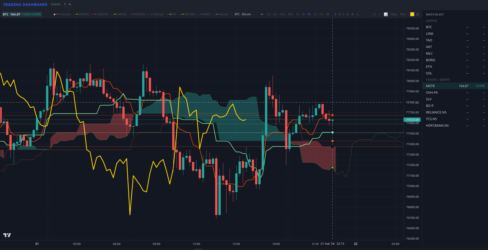

# Trading Dashboard

Real-time multi-pane trading dashboard with **Ichimoku Kinko Hyo**, EMA/SMA/RSI/MACD/Bollinger, drawing tools, and live price updates via WebSocket.

- **Backend**: Python / Flask + Flask-SocketIO
- **Frontend**: Vanilla HTML/CSS/JS + Lightweight Charts v5
- **Data**: Yahoo Finance (stocks) + Hyperliquid (crypto)

---

## Quick Start

```bash
git clone https://github.com/babar92/tradingdash.git
cd tradingdash
pip3 install -r backend/requirements.txt
python3 backend/app.py
```

Open **http://localhost:5000** in your browser.

> Use `?symbol=BTC&timeframe=4h` to auto-load:  
> `http://localhost:5000/?symbol=BTC&timeframe=4h`

---

## Features

### Multi-Pane Grid
- 1, 2, 4, 6, or 8 charts in a resizable grid
- Each pane is independent: symbol, timeframe, indicators, chart type
- State persisted in localStorage

### Chart Types
- Candles, Bar, Line, Area — switch per pane via button bar

### Timeframes
1m / 5m / 15m / 30m / 1h / 2h / 4h / 1d / 1w / 1M

### Indicators
| Indicator | Description |
|-----------|-------------|
| **Ichimoku** | Tenkan, Kijun, Span A/B, Chikou, Kumo (cloud), cross markers, cloud reversal markers |
| **SMA 20** | Simple Moving Average |
| **EMA 20** | Exponential Moving Average |
| **EMA 50 / 200** | With crossover markers |
| **Bollinger** | Bands with 40% opacity fill |
| **RSI** | Relative Strength Index (sub-chart) |
| **RSI+EMA** | RSI with 50-period EMA + crossover markers (sub-chart) |
| **MACD** | Moving Average Convergence Divergence (sub-chart) |
| **Volume** | Volume bars (sub-chart) |

### Layers Panel
Each indicator has an eye icon toggle in the pane controls bar. Click to show/hide without affecting other indicators.

### Drawing Tools
- Trend line
- Linear Regression with standard deviation bands
- Fibonacci Retracement / Extension
- Color picker
- Clear all drawings

### Data Sources
- **Yahoo Finance**: stocks, ETFs, commodities (`MSTR`, `TSLA`, `AAPL`, `SLV`, `BZ=F`, NSE India etc.)
- **Hyperliquid**: crypto (`BTC`, `ETH`, `SOL`, `DOGE`, `LINK`, etc.)

### Live Updates
- Stocks: WebSocket push via yfinance streaming
- Crypto: REST polling, auto-refresh every ~5s

### Auto-Start (Linux systemd)
```bash
cp systemd/*.service ~/.config/systemd/user/
systemctl --user daemon-reload
systemctl --user enable --now trading-dashboard.service
systemctl --user enable --now trading-view-launcher.service
```
The launcher opens Firefox at `http://localhost:5000/?symbol=BTC&timeframe=4h` on login.

### Mobile / Android (PWA)
The dashboard is a **Progressive Web App**. On Chrome for Android:
1. Open `http://localhost:5000` (or your server's URL)
2. Tap the "Install" banner / menu → "Add to Home Screen"
3. Opens in fullscreen standalone mode like a native app

> For remote access from your phone, run the server on your LAN IP:
> ```bash
> python3 backend/app.py --host 0.0.0.0 --port 5000
> ```
> Then open `http://<YOUR_LAN_IP>:5000` on the phone.

---

## Project Structure

```
trading-dashboard/
├── backend/
│   ├── app.py                 # Flask server + SocketIO + REST API
│   ├── data_source.py         # Data source abstraction
│   ├── requirements.txt
│   └── sources/
│       ├── hyperliquid.py     # Hyperliquid crypto data
│       └── yfinance.py        # Yahoo Finance stocks
├── frontend/
│   ├── index.html             # Main SPA entry point
│   ├── manifest.json          # PWA manifest
│   ├── sw.js                  # Service worker (offline cache)
│   ├── css/
│   │   └── style.css          # TradingView-style dark theme
│   └── js/
│       ├── app.js             # Orchestrator, URL params, layout
│       ├── chart-pane.js      # Chart lifecycle, indicators, layers, drawings
│       ├── data-bridge.js     # OHLC fetch + WebSocket subscriptions
│       ├── drawings.js        # Drawing tools (canvas overlay)
│       ├── grid-manager.js    # Grid layout (1/2/4/6/8 panes)
│       ├── indicators.js      # Indicator calculations
│       ├── lightweight-charts.js  # Self-hosted library
│       ├── socket.io.js       # Socket.IO client
│       └── watchlist.js       # Symbol search + add
├── start.sh                   # Quick-start script
└── .gitignore
```

---

## API Endpoints

| Endpoint | Params | Description |
|----------|--------|-------------|
| `GET /api/sources` | — | List available data sources |
| `GET /api/symbols` | `source` | List symbols for a source |
| `GET /api/symbols-embedded` | — | All symbols from all sources |
| `GET /api/ohlc` | `source`, `symbol`, `timeframe`, `limit` | OHLCV data |

WebSocket events: `subscribe_stock`, `unsubscribe_stock`, `price_update`.

---

## Dependencies

- Python 3.9+
- Flask, Flask-SocketIO, Flask-CORS
- yfinance, pandas, requests
- Modern browser (Firefox 146+, Chrome 120+)

---

## License

MIT
